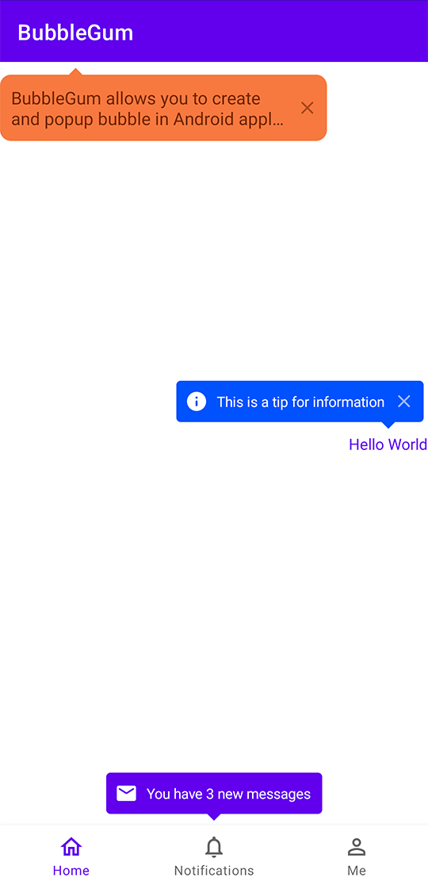

# BubbleGum

[](https://github.com/FutureIsHereX/BubbleGum/blob/main/LICENSE)
[](https://github.com/FutureIsHereX/BubbleGum)

`BubbleGum` allows you to create and pop up bubble in Android application.

## Download

Download the latest AAR in `releases` section and import in your `build.gradle`.

BubbleGum requires at minimum `Android 6.0` (`API 23`).

## Usage

```kotlin
BubbleGum.Builder(this)
    .targetView(targetView)
    .icon(iconView)
    .text("some text")
    .show()
```

## Screenshot



## TODO

- [ ] Add support for independent window mode
- [ ] Add support for custom layout in bubble container
- [ ] Add support for bubble can place in the horizontal direction of the target view

License
-------

    Copyright (c) 2022-present. FutureIsHereX

    Licensed under the Apache License, Version 2.0 (the "License");
    you may not use this file except in compliance with the License.
    You may obtain a copy of the License at

       http://www.apache.org/licenses/LICENSE-2.0

    Unless required by applicable law or agreed to in writing, software
    distributed under the License is distributed on an "AS IS" BASIS,
    WITHOUT WARRANTIES OR CONDITIONS OF ANY KIND, either express or implied.
    See the License for the specific language governing permissions and
    limitations under the License.